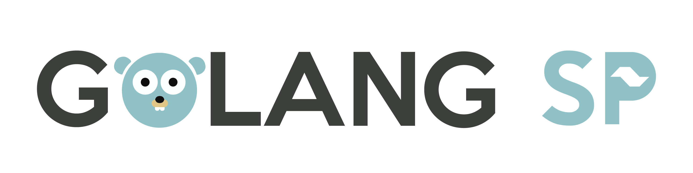
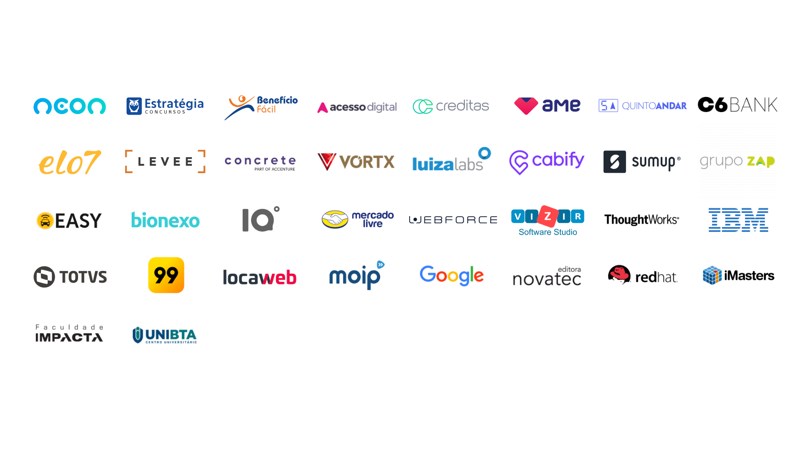

# Plano de Patrocínio

## Sumário
### A Maior Comunidade Go/Golang do Brasil

* [Os Eventos](#os-eventos)
* [A Cidade](#a-cidade)
* [Atividade dos Eventos](#atividade-dos-eventos)
* [Por que Patrocinar?](#por-que-patrocinar)
* [Cotas de Patrocínio](#cotas-de-patrocinio)
* [Contato](#contato)

## Os Eventos

### Difundindo a Linguagem

A comunidade Golang SP é a maior sobre a linguagem de programação Go do Brasil e é suportada por diversos eventos locais. 

Tem como principais objetivos: difundir a linguagem Go; promover a troca de experiências e conhecimento; incentivar o crescimento da comunidade impactando economicamente e socialmente.

Seu público é composto, principalmente, por pessoas nas áreas de desenvolvimento, engenharia de software, empresarial, gerentes de TI, acadêmica, estudantes e entusiastas.

Durante os eventos, os participantes podem aprender sobre novas tecnologias, compartilhar conhecimento e experiências, ter contato com grandes nomes da comunidade nacional e internacional. Tudo isso em um ambiente amistoso, de boa convivência, inclusivo e livre de intimidações, onde todas as pessoas são bem-vindas.

## A Cidade

### Cidade Global Alfa

São Paulo é principal centro financeiro, corporativo e mercantil da América do Sul. A capital paulista é a cidade mais populosa do Brasil e também possui um caráter cosmopolita. Em 2016, possuía moradores nativos de 196 países diferentes e é a cidade brasileira mais influente no cenário global, sendo, em 2016, a 11ª cidade mais globalizada do planeta, recebendo a classificação de **cidade global alfa**, por parte do *Globalization and World Cities Study Group & Network* (GaWC). O lema da cidade, presente em seu brasão oficial, é ***Non ducor, duco***, frase latina que significa "Não sou conduzido, conduzo".

Fundada em 1554, a cidade é mundialmente conhecida e exerce significativa influência nacional e internacional, seja do ponto de vista cultural, econômico ou político. Conta com importantes pontos turísticos, como o Memorial da América Latina, o Museu da Língua Portuguesa, o Museu do Ipiranga, o MASP, o Parque Ibirapuera, o Jardim Botânico de São Paulo e a avenida Paulista, e eventos de grande repercussão.

O município possui o 10º maior PIB do mundo, representando, isoladamente, 10,7% de todo o PIB brasileiro e 36% de toda a produção de bens e serviços do estado de São Paulo

## Atividade dos Eventos

### Horas de Imersão

**PALESTRAS**

A maior parte das palestras são escolhidas pelas pessoas que compõem a comunidade e abordão diversos temas nas mais diversas áreas em que se usa Go.

**LIGHTNING TALKS**

Fugindo do modelo tradicional, as lightning talks são apresentações curtas, objetivas e espontâneas dos participantes e incentivam o diálogo e o compartilhamento de experiências entre pessoas da comunidade.

## Por que Patrocinar?

A comunidade Golang SP reúne um público composto por pessoas nas áreas de desenvolvimento, engenharia de software, empresarial, gerentes de TI, acadêmica, estudantes e entusiastas.

É uma oportunidade de associar a sua marca a iniciativas abertas e colaborativas de software livre, conhecer a comunidade e os projetos que estão em andamento, difundir a linguagem e estimular o desenvolvimento tecnológico no país.

Como retorno, além de alcançar visibilidade, você poderá capacitar a sua equipe, oferecer propostas, recrutar profissionais e/ou criar parcerias de negócios.

## Quantidade de Incrições

É importante esclarecer que a quantidade de incrições é limitada de acordo com o espaço onde o evento é realizado.

### Quem já cedeu espaço os eventos

## Cotas de Patrocínio

### Faça Parte do Evento

**DIAMANTE**: R$ 2.000,00

**Exposição da Marca**
* Apresentação da marca na camisa do evento.
* Apresentação da marca no site do evento.
* Apresentação da marca no banner de entrada do evento.
* Possibilidade de ofertar brindes aos participantes durante o evento.
* Exposição da marca nas salas do evento.
* Divulgação em nossas redes sociais, além de vídeo institucional (30s).

**PLATINA**: R$ 1.000,00

**Exposição da Marca**
* Apresentação da marca na camisa do evento.
* Apresentação da marca no site do evento.
* Apresentação da marca no banner de entrada do evento.
* Possibilidade de ofertar brindes aos participantes durante o evento.
* Divulgação em nossas redes sociais.

**OURO**:  R$ 500,00

**Exposição da Marca**
* Apresentação da marca na camisa do evento.
* Apresentação da marca no site do evento.
* Possibilidade de ofertar brindes aos participantes durante o evento.
* Divulgação em nossas redes sociais.

## Contato
### Se interessou? Alguma dúvida? Entre em contato com a Organização

[info@golang.sampa.br](info@golang.sampa.br)